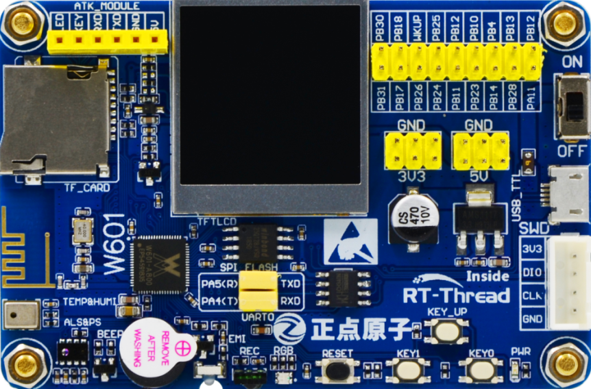

# RT-Thread W60X SDK Description

## Introduction

The RT-Thread W60X SDK includes a detailed introduction to the W601 IoT Board development platform and a wealth of software resources.

With the rise of the Internet of Things (IoT), new development needs are constantly emerging, and more and more devices require connectivity. Traditional development methods are no longer sufficient to meet these demands. To improve development efficiency, more common components are needed. Therefore, the W60X SDK not only explains how to use the development board resources, but also introduces common RT-Thread components and a rich set of software packages for IoT applications. These packages will greatly facilitate developers' development process.

## W601 IoT Board Development Board Resource Overview

### Hardware Resource Description

The W601 IoT Board development board is shown in the figure below:

The development board's core chip resources are as follows:

Supports multi-interface, multi-protocol IEEE802.11n wireless LAN (1T1R). Integrated Cortex-M3 core with an 80MHz clock speed. Built-in 1MB Flash and 288KB SRAM. Integrated RF transceiver front-end, CMOS PA, and baseband processor/media access control. Supports SDIO, SPI, UART, GPIO, I²C, PWM, I²S, 7816, and other interfaces. Supports multiple encryption and decryption protocols, including PRNG, SHA1, MD5, RC4, DES, 3DES, AES, CRC, and RSA.

### Software Resource Description

This section introduces the W60X SDK software resources. The W60X SDK provides a wealth of sample code for your use. Each sample code is commented to facilitate code understanding. Each sample code is provided as an MDK and IAR project, and supports the GCC development environment. Developers can simply compile and download the project to see experimental results.

The example code list is as follows:

| Number | Category | Folder | Description |
| ---- | ------ | ---------------- | ---------------------------------------------- |
| 01 | Basic | led_blink | LED blinks continuously |
| 02 | Basic | key | Onboard button |
| 03 | Basic | rgb_led | RGB LED color change |
| 04 | Basic | beep | Use a button to control a buzzer |
| 05 | Basic | ir | Simulate an infrared remote control |
| 06 | Driver | lcd | LCD displays text and images |
| 07 | Driver | temp_humi | Drive a temperature and humidity sensor |
| 08 | Driver | als_ps | Drive a light intensity/proximity sensor |
| 09 | Component | fs_tf_card | TF card-based file system example |
| 10 | Component | fal | Use the Flash Abstraction Layer (FAL) component to manage Flash and Partitioning |
| 11 | Component | kv | Using EasyFlash to Store KV Parameters |
| 12 | Component | fs_flash | SPI Flash-Based File System Examples |
| 13 | Component | ulog | Logging System Examples |
| 14 | Component | adbd | ADB Remote Debugging Tool Examples |
| 15 | Component | micropython | Using MicroPython to Control Hardware |
| 16 | Internet of Things | wifi_manager | Using WiFi Manager to Manage and Operate WiFi Networks |
| 17 | Internet of Things | web_config_wifi | Using the Web to Quickly Connect to a WiFi Network |
| 18 | Internet of Things | airkiss | Using AirKiss to Quickly Connect to a WiFi Network |
| 19 | Internet of Things | atk_module | ATK Module Examples |
| 20 | Internet of Things | at_server | AT Command (Server-Side) Examples |
| 21 | Internet of Things | mqtt | Implementing MQTT Protocol Communication Using the Paho-MQTT Package |
| 22 | Internet of Things | http_client | Implementing an HTTP Client Using the Web Client Package |
| 23 | Internet of Things | web_server | Using the WebNet Web Server Component |
| 24 | Internet of Things | websocket | Communicating Using the websocket Package |
| 25 | Internet of Things | cjson | Example of Parsing JSON Data Format |
| 26 | Internet of Things | tls | Implementing TLS Communication Using the mbedtls Package |
| 27 | Internet of Things | hw_crypto | Hardware Encryption and Decryption Function Examples |
| 28 | Internet of Things | ota_ymodem | Implementing OTA Firmware Upgrades Using the Ymodem Protocol on the Serial Port |
| 29 | Internet of Things | ota_http | Implementing OTA Firmware Upgrades Using the HTTP Protocol |
| 30 | Internet of Things | netutils | Example of Using the Network Gadget Toolkit |
| 31 | Internet of Things | cloud_rtt | Connect to the RT-Thread IoT Device Management Cloud Platform |
| 32 | IoT | cloud_onenet | Connect to China Mobile's OneNET Cloud Platform |
| 33 | IoT | cloud_ali_iotkit | Connect to the Alibaba Cloud IoT Platform |
| 34 | IoT | cloud_ms_azure | Connect to the Microsoft Azure IoT Platform |
| 35 | IoT | cloud_tencent | Connect to the Tencent Cloud IoT Platform |
| 36 | General | demo | Comprehensive Example Demonstration |

## Introduction to WM_Librarie

WM_Librarie is a development software package provided by Beijing Lianshengde Microelectronics Co., Ltd. It provides many basic functions, including low-level hardware drivers, a WiFi protocol stack, firmware downloads, and one-click network provisioning. The following describes the functions of each of these functions.

### WM_Librarie Function Introduction

### One-Click Network Configuration

This one-click network configuration feature allows you to send the WiFi name and password to the development board via the app, allowing it to connect to a WiFi network. It supports most mobile phones and routers on the market, with a high success rate and fast configuration speed.

### Chip Peripheral Driver Library

Provides driver support for various peripheral modules of the W60X chip, including UART, SPI, TIMER, PWM, WDG, etc. It features high efficiency and low resource usage.

### WiFi Function Library

Provides a complete WiFi protocol stack, including support for STA, SOFTAP, and AP/STA. This comprehensive WiFi functionality makes WiFi operation easier for average users and more flexible for advanced users.

### Firmware Packaging

Provides firmware packaging suitable for various environments. The firmware generator is compiled using a cross-platform language and can run on multiple platforms. It can also generate multiple different firmware types to suit different upgrade scenarios.

## Document Description

### SDK Documentation Introduction

SDK-related documents are in the docs folder. The document list is as follows:

| Document Name | Description |
| --------------------------------------------------- | ---------------------------------------- |
| board folder | Development board-related documentation, such as schematics, datasheets, etc. |
| AN0001-RT-Thread-Serial Port Device Application Note.pdf | Serial Port Driver Note |
| AN0002-RT-Thread-General GPIO Device Application Note.pdf | General GPIO Device Application Note |
| AN0003-RT-Thread-I2C Device Application Note.pdf | I2C Device Application Note |
| AN0004-RT-Thread-SPI Device Application Note.pdf | SPI Device Application Note |
| AN0006-RT-Thread-Using QEMU for Emulation Debugging.pdf | Using QEMU to Debug RT-Thread |
| AN0009-RT-Thread_Using the SystemView Analysis Tool.pdf | Using SystemView for Debugging |
| AN0010-RT-Thread - Network Protocol Stack Driver Porting Notes.pdf | lwip Driver Porting |
| AN0011-RT-Thread - Network Development Application Notes.pdf | Network Development Application Notes |
| AN0012-RT-Thread - File System Application Notes.pdf | RT-Thread File System Application Notes |
| AN0014-RT-Thread - AT Component Application Notes - Client Edition.pdf | RT-Thread AT Component Application Notes - Client Edition |
| AN0017-RT-Thread - Creating a Standard Project.pdf | Creating an RT-Thread Standard Project |
| AN0018-RT-Thread - Network Toolset Application Notes.pdf | RT-Thread Network Toolset (NETUTILS) Application Notes |
| AN0020-RT-Thread - Debugging with Eclipse and QEMU.pdf | Debugging RT-Thread with Eclipse and QEMU |
| AN0021-RT-Thread - Using VS Code and QEMU Debugging.pdf | Debugging RT-Thread with VS Code and QEMU |
| AN0022-RT-Thread-ulog Logging Component Application Note - Basics.pdf | RT-Thread-ulog Logging Component Application Note - Basics |
| AN0023-RT-Thread-Using QEMU to Run Dynamic Modules.pdf | Using QEMU to Run RT-Thread Dynamic Modules |
| AN0024-RT-Thread-ulog Logging Component Application Note - Advanced.pdf | RT-Thread-ulog Logging Component Application Note - Advanced |
| AN0025-RT-Thread-Power Management Component Application Note.pdf | Power Management Application Note |
| RT-Thread Programming Guide.pdf | RT-Thread Programming Guide |
| UM1001-RT-Thread-WebClient User Manual.pdf | WEBCLIENT User Manual |
| UM1002-RT-Thread-ali-iotkit User Manual.pdf | RT-Thread ALI-IOTKIT User Manual |
| UM1003-RT-Thread-OneNET User Manual.pdf | RT-Thread ONENET User Manual |
| UM1004-RT-Thread-OTA User Manual.pdf | RT-Thread OTA User Manual |
| UM1005-RT-Thread-Paho-MQTT User Manual.pdf | PAHO-MQTT User Manual |
| UM1006-RT-Thread-MbedTLS User Manual.pdf | RT-Thread MBEDTLS User Manual |
| UM1007-RT-Thread-Azure-IoT-SDK User Manual.pdf | AZURE-IOT-SDK User Manual |
| UM1008-RT-Thread-Device Maintenance Cloud Platform User Manual.pdf | RT-Thread Cloud Platform User Manual |
| UM1009-RT-Thread-Power Management Component User Manual.pdf | POWER MANAGEMENT User Manual |
| UM1010-RT-Thread-Web Server (WebNet) User Manual.pdf | RT-Thread WEBNET User Manual |
| UM3101-RT-Thread-W60X-SDK Development Manual.pdf | RT-Thread W60X SDK Development Manual |
| UM3102-RT-Thread-W60X-SDK Introduction.pdf | RT-Thread W60X SDK Description |
| UM3103-RT-Thread-W60X-SDK Quick Start.pdf | RT-Thread W60X SDK Quick Start |
| UM3104-RT-Thread-W60X-SDK Release Notes.pdf | RT-Thread W60X SDK Development Manual |

### WM_Librarie Documentation

The WM_Librarie library also contains extensive documentation for your reference. The following only introduces some documentation related to the current SDK. The document path is: RT-Thread_W60X_SDK/libraries/WM_Libraries/Doc.

| Document Name | Description |
| ------------------------------------------------------ | ---------------------------- |
| OneShot Lib&Demo Folder | One-Click Network Configuration Source Code and App |
| W60X_QFLASH_Driver_for_SWD Folder | Keil QFLASH Driver for JTAG Debugging |
| WM_W600_OneShotConfig2.0(Android) SDK User Manual_V1.0.pdf | One-Click Network Configuration Android SDK User Manual |
| WM_W600_OneShotConfig2.0(iOS) SDK User Manual_V1.0.pdf | One-Click Network Configuration iOS SDK User Manual |
| WM_W600_ROM Function Description_V1.1.pdf | ROM Function User Manual |
| WM_W600_SECBOOT Function Description_V1.0.pdf | SECBOOT Function Description Manual |
| WM_W600_SWD Debug Configuration Guide_V1.2.pdf | SWD Debug Configuration Manual |
| WM_W600 Parameter Area Usage Instructions_V1.1.pdf | Parameter Area Usage Manual |
| WM_W600 Firmware Upgrade Guide_V1.1.pdf | Firmware Upgrade Guide Manual |
| WM_W600 Firmware Generation Instructions_V1.1.pdf | Firmware Generation Instructions Manual |
| WM_W601 Register Manual_v1.2.pdf | Register Manual |

## Prerequisites

The prerequisites for using the W60X SDK are as follows:

- RT-Thread Basics
- RT-Thread Development Environment

For more information on RT-Thread basics, please visit the RT-Thread Documentation Center [Documentation Center](https://www.rt-thread.org/document/site/)