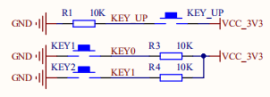
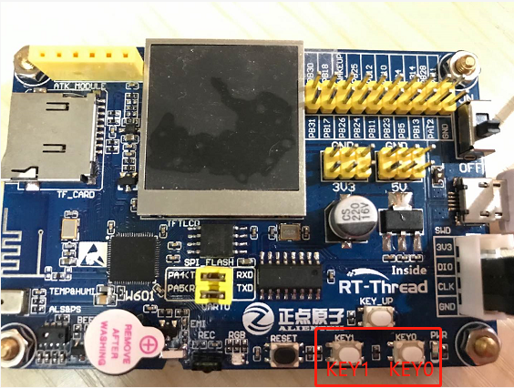
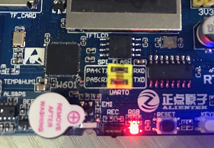

# 按键输入例程

## 简介

本例程的主要功能是让板载的 KEY0 控制 RGB-LED 中红色 LED 的亮灭。

## 硬件说明




如上图所示，KEY0 引脚连接单片机 PA7（35）引脚，且外部接 10k 上拉电阻。KEY0 按键按下为低电平，松开为高电平。KEY0 在开发板中的位置如下图所示：



## 软件说明

闪灯的源代码位于 `/examples/02_basic_key/applications/main.c` 中。定义了宏 `PIN_KEY0`  , KEY0 与单片机 `35` 号引脚相对应。

```c
/* using KEY0  */
#define PIN_KEY0      (35)
```

在 main 函数中，首先为了实验效果清晰可见，板载 RGB 红色 LED 作为 KEY0 的状态指示灯，设置 RGB 红灯引脚的模式为输出模式，然后设置 PIN_KEY0 引脚为输入模式，最后在 while 循环中通过 rt_pin_read(PIN_KEY0) 判断 KEY0 的电平状态，并作 50ms 的消抖处理，如果成功判断 KEY0 为低电平状态（即按键按下）则打印输出 “KEY0 pressed!” 并且指示灯亮，否则指示灯熄灭。

```c
int main(void)
{
    unsigned int count = 1;
    
    /* 设置 PIN_LED_R 引脚为输出模式 */
    rt_pin_mode(PIN_LED_R, PIN_MODE_OUTPUT);
    /* 设置 PIN_KEY0 引脚为输入模式 */
    rt_pin_mode(PIN_KEY0, PIN_MODE_INPUT);

    while (count > 0)
    {
        /* 读取 PIN_KEY0 引脚的状态 */
        if (rt_pin_read(PIN_KEY0) == PIN_LOW)
        {
            rt_thread_mdelay(50);
            if (rt_pin_read(PIN_KEY0) == PIN_LOW)
            {
                LOG_D("KEY0 pressed!");
                rt_pin_write(PIN_LED_R, PIN_LOW);
            }
        }
        else
        {
            rt_pin_write(PIN_LED_R, PIN_HIGH);
        }
        rt_thread_mdelay(10);
        count++;
    }
    return 0;
}
```

## 运行

### 编译 & 下载

- **MDK**：双击 `project.uvprojx` 打开 MDK5 工程，执行编译。

编译完成后，将固件下载至开发板。

### 运行效果

按下复位按键重启开发板，按住 KEY0 可以观察到开发板上 RBG 红色 LED 指示灯的亮起，松开 KEY0 可以观察到开发板上的 RBG 红色 LED 指示灯熄灭。按住 KEY0 按键后如下图所示：



此时也可以在 PC 端使用终端工具打开开发板的 `uart0` 串口，设置 `115200-8-1-N` 。开发板的运行日志信息即可实时输出出来。

```shell
[D/main] KEY0 pressed!
[D/main] KEY0 pressed!
[D/main] KEY0 pressed!
```

## 注意事项

如果想要修改 PIN_LED_R 或者 PIN_KEY0 宏定义，可以参考 /drivers/pin_map.c 文件，该文件中里有定义单片机的其他引脚编号。

## 引用参考

- 《通用GPIO设备应用笔记》: docs/AN0002-RT-Thread-通用 GPIO 设备应用笔记.pdf
- 《RT-Thread 编程指南》: docs/RT-Thread 编程指南.pdf
